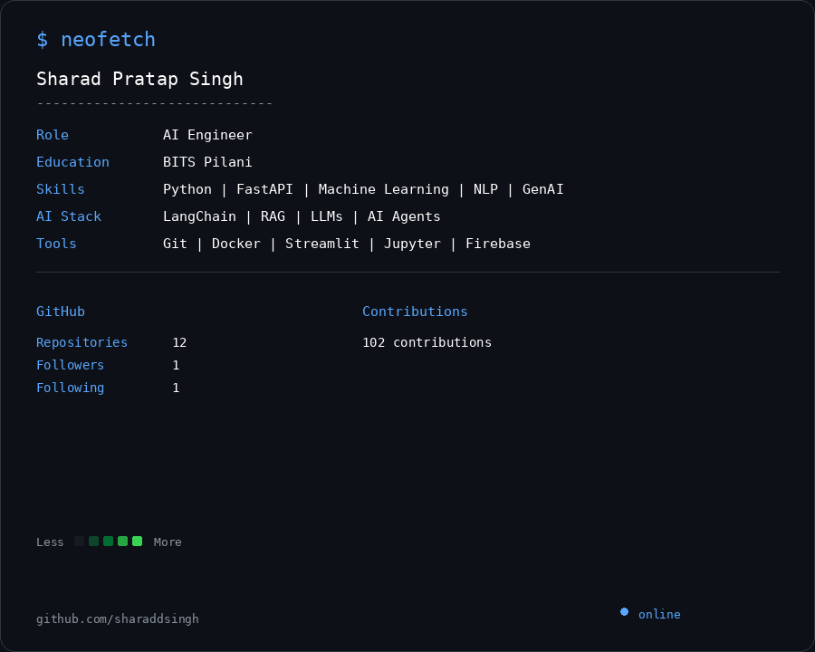

# Sharad Pratap Singh

  

  <strong>AI Engineer · BITS Pilani</strong>

  Building AI applications, machine learning systems, and GenAI solutions.

---

## About

I'm an aspiring AI Engineer focused on building practical AI and machine learning applications.

My current interests include:

- Artificial Intelligence
- Machine Learning
- Natural Language Processing
- Generative AI
- Large Language Models
- Retrieval-Augmented Generation
- AI Agents
- Backend APIs for AI applications

---

## Tech Stack

### AI / Machine Learning

- Python
- Machine Learning
- NLP
- Generative AI
- LLMs
- RAG
- LangChain
- AI Agents

### Backend / Applications

- FastAPI
- Streamlit
- Firebase

### Tools

- Git
- GitHub
- Docker
- Jupyter

---

## Featured Projects

### AI / GenAI

Building AI-powered applications using LLMs, RAG pipelines, agents, APIs, and vector-based retrieval.

### Employee Attrition Analytics Platform

An ML-powered application for employee attrition prediction with explainable predictions and batch analysis.

### Attendance Tracker

A Firebase-based attendance management system with QR attendance, authentication, dashboards, and leave management.

---